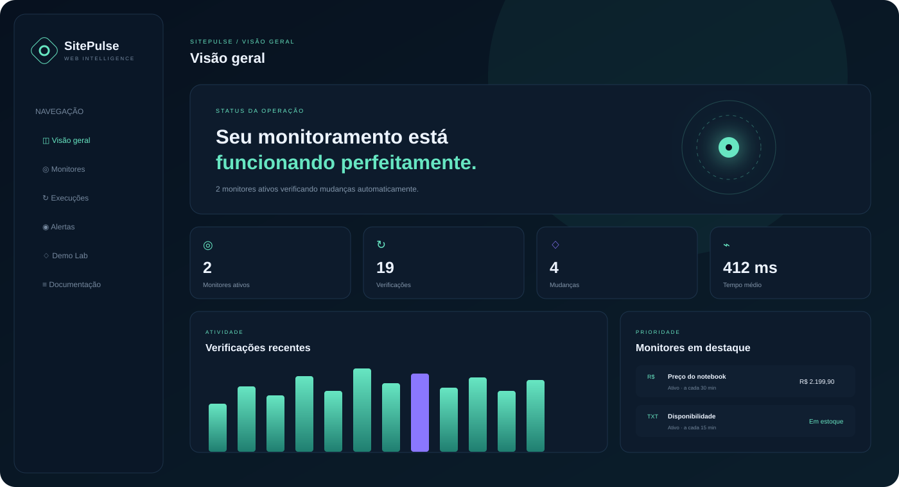
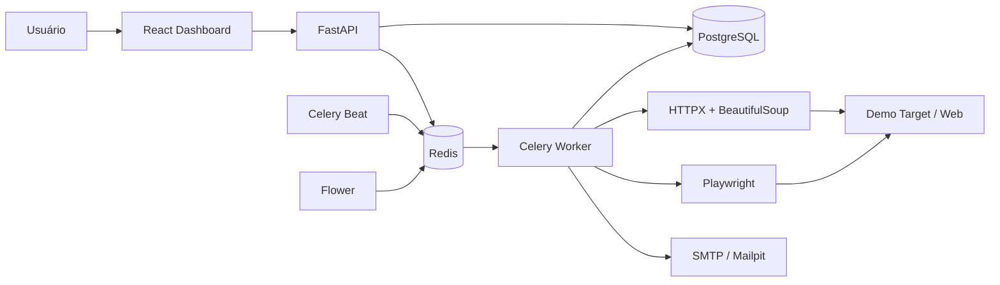

# SitePulse — Web Scraper & Change Monitoring

> Plataforma completa de monitoramento de páginas, detecção de mudanças e alertas, construída para demonstrar scraping, filas, testes, Docker e CI/CD em um projeto de portfólio executável.



[](https://github.com/drsklgfa/sitepulse/actions/workflows/ci.yml)
[](https://github.com/drsklgfa/sitepulse/actions/workflows/security.yml)
[](backend/pyproject.toml)
[](backend/app/main.py)
[](frontend/package.json)
[](compose.yaml)

## Por que este projeto existe

O SitePulse foi projetado como **produto real e projeto-vitrine**. Quem visitar o GitHub consegue entender a proposta, arquitetura, experiência e qualidade sem instalar nada. Quem clonar o repositório consegue iniciar toda a plataforma com Docker e testar o fluxo completo em um ambiente controlado.

O repositório não depende de Amazon, Mercado Livre ou qualquer página externa para provar que funciona. O serviço **Demo Target** simula produto, notícias, JavaScript, lentidão e erros HTTP.

## Demonstração em 3 passos

```bash
cp .env.example .env
docker compose up --build
```

No Windows PowerShell:

```powershell
Copy-Item .env.example .env
.\scripts\start.ps1
```

Depois acesse:

| Serviço | Endereço |
|---|---|
| Dashboard | http://localhost:3000 |
| API / Swagger | http://localhost:8000/docs |
| Demo Target | http://localhost:8080/product |
| Mailpit | http://localhost:8025 |
| Flower | http://localhost:5555 |

Credenciais demonstrativas:

```text
E-mail: demo@sitepulse.local
Senha: SitePulseDemo123!
```

### Fluxo sugerido

1. Entre no dashboard.
2. Abra **Demo Lab** e altere o preço.
3. Execute o monitor de preço.
4. Veja o worker processar a tarefa.
5. Confira o snapshot, o alerta e o e-mail no Mailpit.

## Arquitetura



## Funcionalidades implementadas

### Monitoramento

- páginas estáticas com HTTPX e BeautifulSoup;
- páginas dinâmicas com Playwright;
- seletor CSS;
- extração de texto, preço, número, HTML, atributo e status HTTP;
- normalização de valores em formatos brasileiro e internacional;
- comparação por hash;
- histórico de snapshots;
- condições de alerta por mudança, queda de preço, limite, palavra e status;
- execução manual e agendada;
- pausa e reativação de monitores.

### Processamento e confiabilidade

- tarefas em segundo plano com Celery;
- Redis como broker e backend;
- scheduler periódico;
- retries com backoff;
- workers separados da API;
- health checks;
- PostgreSQL com SQLAlchemy e Alembic;
- logs e observabilidade com Flower.

### Produto e experiência

- dashboard responsivo;
- modo claro e escuro;
- métricas e histórico;
- central de alertas;
- assistente de criação de monitor;
- Demo Lab integrado;
- documentação dentro da interface;
- GitHub Pages em modo showcase, sem backend.

### Segurança

- autenticação JWT;
- hash PBKDF2-SHA256 com salt;
- validação de URL;
- bloqueio de protocolos inseguros;
- proteção contra SSRF e IPs reservados;
- bloqueio de credenciais embutidas na URL;
- redirecionamentos validados;
- limite máximo de resposta;
- timeout de rede;
- nenhum segredo real no repositório.

> `ALLOW_PRIVATE_NETWORKS=true` existe somente no ambiente local do Docker para permitir que o scraper acesse o Demo Target. Em produção, mantenha `false`.

## Estrutura do repositório

```text
sitepulse/
├── backend/               # FastAPI, Celery, scraping e testes
│   ├── app/
│   │   ├── api/routes/
│   │   └── services/
│   ├── alembic/
│   └── tests/
├── frontend/              # React, TypeScript e Vite
├── demo-target/           # Website controlado para testes
├── docs/                  # Arquitetura, segurança e deploy
├── scripts/               # Validação, checkpoint e PowerShell
├── .github/workflows/     # CI, segurança e GitHub Pages
├── compose.yaml
├── Makefile
└── README.md
```

## Comandos úteis

```bash
make start          # inicia tudo
make stop           # encerra os containers
make logs           # acompanha os logs
make status         # mostra a saúde dos serviços
make test           # testes backend + Demo Target
make validate       # verifica estrutura e sintaxe
make reset          # remove volumes e recria o ambiente
make checkpoint     # gera ZIP e SHA-256
```

## Testes

Backend:

```bash
cd backend
python -m pip install -e ".[dev]"
python -m pytest --cov=app --cov-report=term-missing
```

Frontend:

```bash
cd frontend
npm install
npm run test
npm run build
```

Demo Target:

```bash
cd demo-target
python -m pip install -r requirements.txt
PYTHONPATH=. python -m pytest
```

## GitHub Pages

O workflow `pages.yml` publica a interface em **showcase mode**. Nesse modo, dados demonstrativos são carregados no navegador e nenhuma API é necessária. O objetivo é permitir que recrutadores explorem o visual diretamente pelo GitHub.

Para ativar:

1. Suba o repositório.
2. Abra **Settings → Pages**.
3. Escolha **GitHub Actions** como origem.
4. Execute o workflow **Pages Showcase**.

## Uso responsável

O SitePulse deve ser utilizado somente em páginas públicas ou em ambientes para os quais exista autorização. O projeto não implementa evasão de CAPTCHA, quebra de autenticação, contorno de bloqueios ou ocultação de identidade. Respeite termos de uso, limites de acesso, direitos autorais e legislação aplicável.

## Documentação

- [Arquitetura](docs/ARCHITECTURE.md)
- [API e regras de domínio](docs/API.md)
- [Segurança](docs/SECURITY.md)
- [Deploy](docs/DEPLOYMENT.md)
- [Guia de demonstração](docs/DEMO.md)
- [Restauração do checkpoint](RESTORE.md)
- [Validação da entrega](VALIDATION_REPORT.md)

## Roadmap opcional

A versão atual entrega o ciclo funcional completo. Evoluções possíveis:

- webhooks para Discord, Slack e Teams;
- regras compostas de alertas;
- captura de screenshot e comparação visual;
- proxy corporativo autorizado;
- multi-tenant e planos SaaS;
- OpenTelemetry e Prometheus;
- retenção configurável de snapshots;
- exportação CSV/PDF;
- plugin oficial de navegador.

## Licença

MIT. Consulte [LICENSE](LICENSE).
