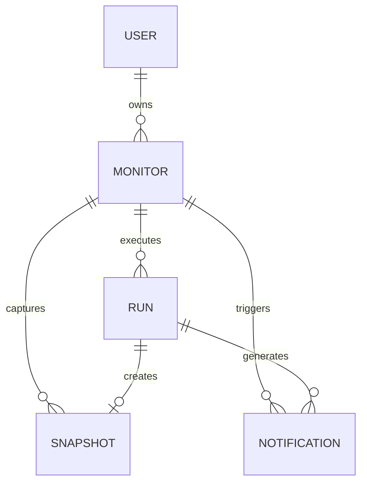

# Arquitetura

## Princípios

1. A API não aguarda scraping demorado.
2. O worker é idempotente no contexto de uma execução registrada.
3. Cada captura gera uma trilha auditável.
4. O modo de demonstração não depende de serviços de terceiros.
5. Segurança de URL acontece antes de qualquer conexão.

## Componentes

### Frontend

React + TypeScript. Consome a API no modo real e usa dados locais no showcase do GitHub Pages.

### API

FastAPI expõe autenticação, CRUD de monitores, dashboard, execuções, notificações e endpoints de saúde.

### Worker

Celery executa capturas, normalização, comparação, snapshots e notificações. O Redis mantém a fila.

### Scheduler

Celery Beat procura monitores vencidos a cada minuto e envia novas tarefas.

### Persistência

PostgreSQL armazena usuários, monitores, execuções, snapshots e notificações. Alembic mantém o schema versionado.

### Demo Target

Aplicação separada que simula páginas estáticas, dinâmicas, lentas e instáveis. Seu estado fica persistido em volume Docker.

## Modelo de dados

## Decisões técnicas

- SQLAlchemy síncrono foi escolhido para compartilhar o mesmo domínio entre FastAPI e Celery sem duplicar camadas.
- Playwright é utilizado somente quando `render_js=true`, reduzindo consumo em páginas comuns.
- O primeiro snapshot não dispara alerta de mudança, pois ainda não existe referência anterior.
- O Demo Target é permitido explicitamente em redes privadas somente no perfil local.
